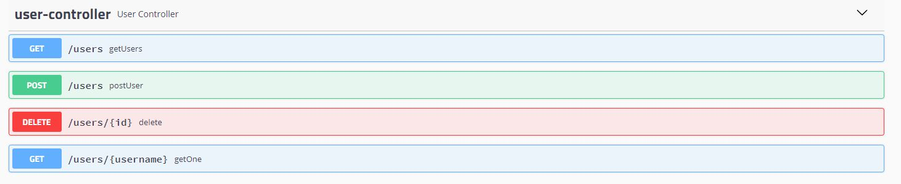

# WEB API using Spring and Swagger
API developed using Spring and Swagger to documentation

## Requirements
 - Maven
 - Spring Boot
 - Java 17

## Endpoints

- GET (getUsers)
  - List all system users
- GET (getOne)
  - FIND/id - Receive id to find a user
- POST (postUser)
  - UPDATE - Receive user informations to update a user
- DELETE
  - DELETE/id - Receive id to remove a user

